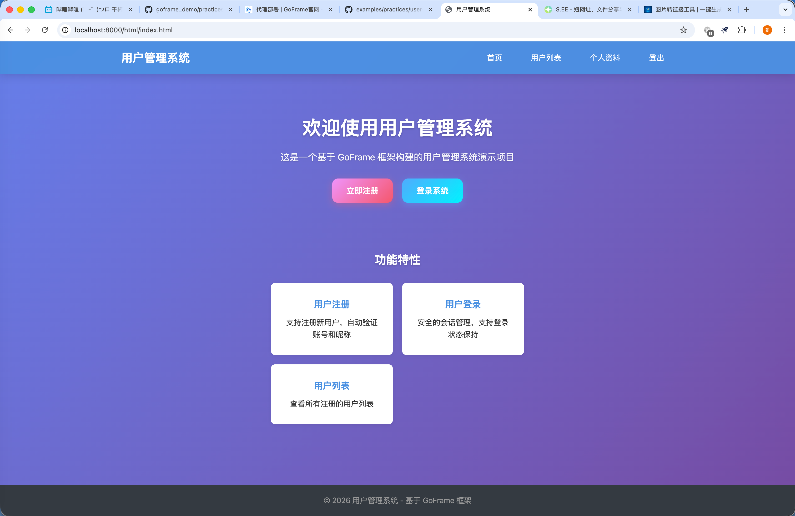
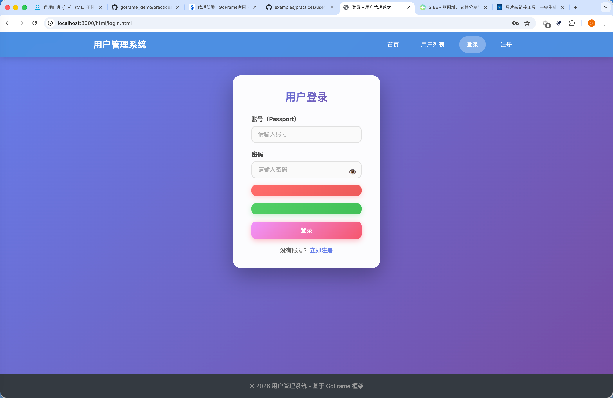
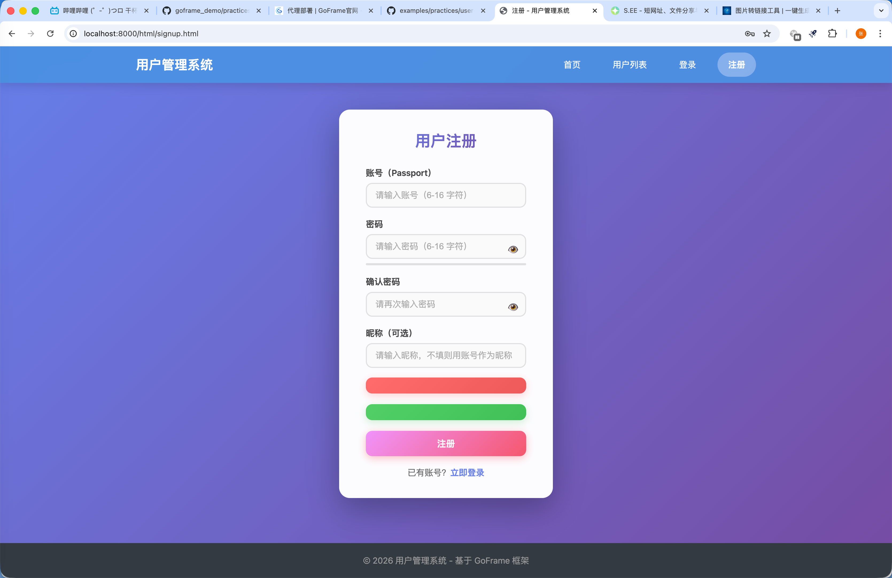
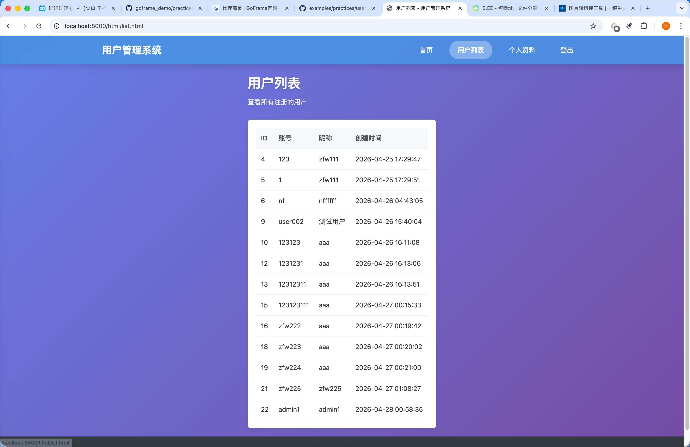
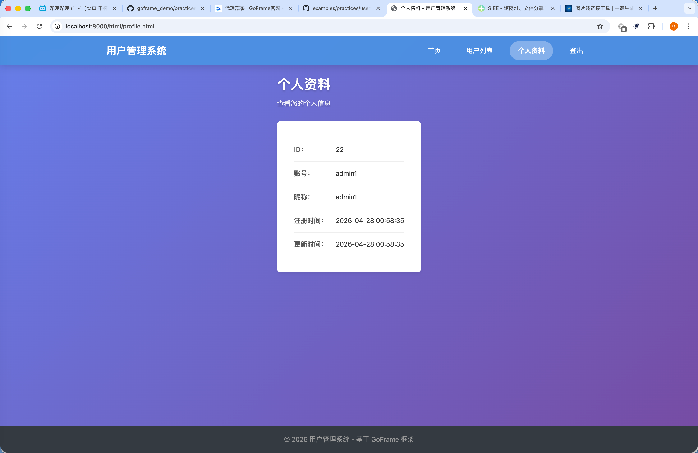

# 我的用户 HTTP 服务

## 介绍

基于 GoFrame 框架构建的用户管理 HTTP 服务。该示例包含：

- 用户注册、登录和登出功能
- 基于会话的认证机制
- HTTP 中间件
- MySQL 数据库集成
- 自动生成的 OpenAPI 文档
- Service 层业务逻辑
- 现代化的前端界面（渐变背景、动画效果、响应式设计）

## 目录结构

```text
.
├── api/                    # API 定义
│   └── user/             # 用户服务 API
│       ├── user.go         # 用于API完整性实现的检测接口(自动生成)
│       └── v1/          # API定义，v1版本
├── hack/                 # 开发工具
│   └── config.yaml       # CLI 工具配置
├── internal/             # 内部包
│   ├── cmd/              # 命令定义
│   │   └── cmd.go        # 主命令与服务器设置
│   ├── consts/           # 常量
│   ├── controller/      # HTTP 控制器
│   │   └── user/       # 用户控制器
│   ├── dao/              # 数据访问对象(自动生成)
│   ├── logic/            # 业务逻辑(已迁移到 service)
│   ├── model/            # 数据模型
│   │   ├── do/            # 领域对象(自动生成)
│   │   └── entity/        # 数据库实体(自动生成)
│   ├── service/        # 业务逻辑
│   │   ├── bizctx/     # 业务上下文服务
│   │   ├── middleware/   # 中间件服务
│   │   ├── session/       # 会话服务
│   │   └── user/          # 用户服务
│   └── packed/         # 打包文件
├── manifest/           # 部署清单
│   ├── config/         # 配置文件
│   │   └── config.yaml    # 应用配置
│   ├── deploy/        # 部署文件
│   ├── docker/        # Docker 文件
│   └── sql/           # SQL 脚本
├── resource/           # 前端资源
│   ├── public/       # 静态资源
│   │   ├── html/      # HTML 页面
│   │   │   ├── index.html      # 首页
│   │   │   ├── login.html      # 登录页
│   │   │   ├── signup.html     # 注册页
│   │   │   ├── list.html       # 用户列表页
│   │   │   └── profile.html    # 个人资料页
│   │   └── resource/   # 资源文件
│   │       ├── css/       # CSS 样式
│   │       ├── js/        # JavaScript
│   │       └── image/     # 图片
│   └── template/     # 模板文件
├── utility/           # 工具类/工具函数
├── main.go          # 应用入口
├── go.mod           # Go 模块文件
├── go.sum           # Go 模块依赖锁定文件
└── Makefile         # 构建自动化
```

## 功能特性

### 用户管理

- 用户注册（`SignUp`：支持昵称自动用护照号
- 用户登录（`SignIn`）
- 用户登出（`SignOut`）
- 用户列表（`List`）
- 用户查询（`Profile`）
- 登录状态检查（`IsSignedIn`）

### 前端界面优化

- 现代化渐变背景（紫蓝配色）
- 响应式设计，支持各种屏幕尺寸
- 流畅的动画效果（页面滑入、按钮悬停、消息提示）
- 密码显示/隐藏切换功能
- 实时密码强度检测
- 加载状态按钮，防止重复提交
- 键盘快捷键支持（Ctrl+Enter 提交）
- 美观的表单设计，自适应屏幕宽度50%
- 错误/成功消息提示（带抖动/弹出动画）

### 认证与授权

- 基于会话的用户认证
- 自定义业务上下文注入
- 基于中间件的授权机制
- 受保护路由

### 接口文档

- 自动生成的OpenAPI规范
- 自动生成的Swagger UI位于/swagger

### 数据库集成

- MySQL 数据库连接
- DAO 模式数据访问
- 自动生成 DAO、DO和Entity代码
- 事务支持

## 环境要求

### 本地开发
- Go 1.23或更高版本
- MySQL 5.7或更高版本

### Docker 部署
- Docker
- Docker Compose (可选)

# 前置准备

### 配置 MySQL 数据库

使用 Docker 运行 MySQL 数据库：

```bash
docker run -d \
  --name mysql-user-service \
  -p 3306:3306 \
  -e MYSQL_ROOT_PASSWORD=12345678 \
  -e MYSQL_DATABASE=test \
  mysql:8.0
```

如果本地有 MySQL，可以改用端口冲突，可以：

```bash
docker run -d \
  --name mysql-user-service \
  -p 3307:3306 \
  -e MYSQL_ROOT_PASSWORD=12345678 \
  -e MYSQL_DATABASE=test \
  mysql:8.0
```

并修改 `config.yaml` 的端口为 3307。

### 初始化数据库

从旁边的例子项目复制 SQL 脚本或直接在项目执行 SQL：

```sql
CREATE TABLE `user`(
    `id`        int(10) unsigned NOT NULL AUTO_INCREMENT COMMENT 'User ID',
    `passport`  varchar(45) NOT NULL COMMENT 'User Passport',
    `nickname`  varchar(45) NOT NULL COMMENT 'User Nickname',
    `password`  varchar(45) NOT NULL COMMENT 'User Password',
    `create_at` datetime DEFAULT NULL COMMENT 'Created Time',
    `update_at` datetime DEFAULT NULL COMMENT 'Updated Time',
    `delete_at` datetime DEFAULT NULL COMMENT 'Deleted Time',
    PRIMARY KEY (`id`),
    UNIQUE KEY `uniq_passport` (`passport`)
) ENGINE=InnoDB DEFAULT CHARSET=utf8mb4;
```

## 配置说明

在 `manifest/config/config.yaml` 中配置：

```yaml
server:
  address: ":8000"
  openapiPath: "/api.json"
  swaggerPath: "/swagger"

database:
  default:
    link: "mysql:root:12345678@tcp(127.0.0.1:3306)/test?loc=Asia/Shanghai&parseTime=true"
    timezone: "Asia/Shanghai"
```

## 界面预览

### 首页


### 登录页


### 注册页


### 用户列表页


### 个人资料页


## 部署指南

### 方式一：使用一键部署脚本（推荐）

项目提供了 `deploy.sh` 一键部署脚本，最简单的部署方式：

```bash
# 1. 进入项目目录
cd goframe_demo/practices/my-user-http-service

# 2. 构建并启动服务
./deploy.sh start

# 3. 查看服务状态
./deploy.sh status

# 4. 查看日志
./deploy.sh logs
```

**访问地址：** http://localhost:8000/html/index.html

**常用命令：**
```bash
./deploy.sh start    # 启动服务
./deploy.sh stop     # 停止服务
./deploy.sh restart  # 重启服务
./deploy.sh status   # 查看状态
./deploy.sh logs     # 查看日志
./deploy.sh clean    # 清理所有资源
```

### 方式二：Docker Compose 部署

```bash
# 1. 构建 Linux 二进制文件
GOOS=linux GOARCH=amd64 go build -o temp/linux_amd64/main main.go

# 2. 构建 Docker 镜像
docker build -t my-user-service:latest -f manifest/docker/Dockerfile .

# 3. 启动服务
docker-compose up -d

# 4. 查看服务状态
docker-compose ps
```

### 方式三：Kubernetes 部署

项目已包含 Kubernetes 部署配置（位于 `manifest/deploy/kustomize/`）：

```bash
# 使用 Kustomize 部署
kubectl apply -k manifest/deploy/kustomize/overlays/develop
```

### 部署文件说明

| 文件 | 说明 |
|------|------|
| `docker-compose.yml` | Docker Compose 配置文件 |
| `deploy.sh` | 一键部署脚本 |
| `manifest/docker/Dockerfile` | Docker 镜像构建文件 |
| `manifest/config/config-docker.yaml` | Docker 环境专用配置 |
| `manifest/sql/init.sql` | 数据库初始化脚本 |

### Docker 环境变量

| 变量名 | 默认值 | 说明 |
|--------|--------|------|
| GF_SERVER_ADDRESS | :8000 | 服务监听地址 |
| GF_DATABASE_HOST | mysql:3306 | 数据库地址 |
| GF_DATABASE_NAME | test | 数据库名称 |
| GF_DATABASE_USER | root | 数据库用户名 |
| GF_DATABASE_PASS | 12345678 | 数据库密码 |

## 使用说明

### 运行服务器

启动 HTTP 服务器：

```bash
cd goframe_demo/practices/my-user-http-service

# 使用 gf run
gf run main.go

# 或直接 go run
go run main.go
```

服务器将在端口 8000 上启动，提供以下接口：

- Swagger UI：<http://localhost:8000/swagger>
- OpenAPI 规范：<http://localhost:8000/api.json>
- 首页：<http://localhost:8000/html/index.html>
- 登录页：<http://localhost:8000/html/login.html>
- 注册页：<http://localhost:8000/html/signup.html>
- 用户列表：<http://localhost:8000/html/list.html>

### 测试服务

#### 使用 Swagger UI

浏览器打开 [http://localhost:8000/swagger](http://localhost:8000/swagger。)

#### 使用 cURL

1. **注册**：

```bash
curl -X POST http://localhost:8000/user/sign-up \
  -H "Content-Type: application/json" \
  -d '{
    "Passport": "user001",
    "Password": "123456",
    "Password2": "123456",
    "Nickname": "测试用户"
  }'
```

1. **登录**：

```bash
curl -X POST http://localhost:8000/user/sign-in \
  -H "Content-Type: application/json" \
  -d '{
    "Passport": "user001",
    "Password": "123456"
  }' \
  -c cookies.txt
```

1. **检查登录状态**：

```bash
curl -X POST http://localhost:8000/user/is-signed-in \
  -b cookies.txt
```

1. **获取用户列表**：

```bash
curl -X GET http://localhost:8000/user/list
```

1. **登出**：

```bash
curl -X POST http://localhost:8000/user/sign-out \
  -b cookies.txt
```

## 接口文档

### 公开接口

#### SignUp

**POST** `/user/sign-up`

注册新用户。

**请求体：**

```json
{
  "Passport": "string (6-16 字符，必填)",
  "Password": "string (6-16 字符，必填)",
  "Password2": "string (必须与 Password 相同，必填)",
  "Nickname": "string (可选)"
}
```

**响应：**

```json
{
  "code": 0,
  "message": "",
  "data": {}
}
```

#### SignIn

**POST** `/user/sign-in`

用户认证并创建会话。

**请求体：**

```json
{
  "Passport": "string (必填)",
  "Password": "string (必填)"
}
```

#### List

**GET** `/user/list`

获取用户列表。

**响应：**

```json
{
  "code": 0,
  "message": "",
  "data": {
    "UserList": [...]
  }
}
```

## 实现细节

### Controller 层

`internal/controller/user/` 处理 HTTP 请求：

- 接收并验证请求参数
- 调用 Service 层处理业务逻辑
- 返回标准化的 JSON 响应

### Service 层

`internal/service/` 包含业务逻辑：

#### 用户服务

- 用户创建带验证
- 认证和会话管理
- 用户资料查询
- 事务支持

#### 中间件服务

- 自定义业务数据的上下文注入
- 受保护路由的认证中间件
- CORS 跨域支持

#### 会话服务

- 用户会话管理
- 会话存储和检索

## 注意事项

- 启动应用前请确保 MySQL 已运行
- 默认数据库凭据为 root:12345678 (生产环境请修改)
- 服务默认使用端口 8000
- 如果端口冲突可以配置 config.yaml 修改地址

